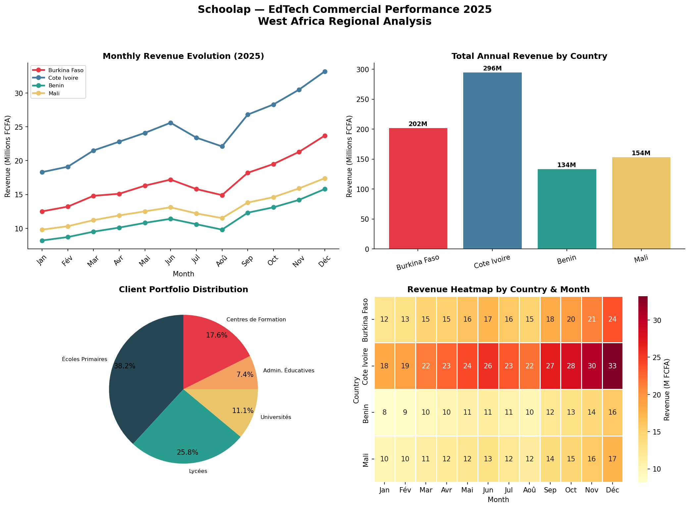
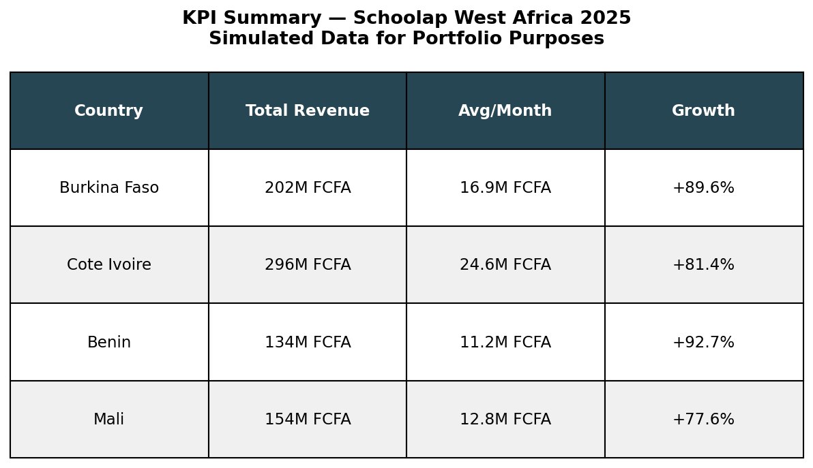

# -*- coding: utf-8 -*-
"""
Created on Mon Jun 08 23:56:19 2026

@author: kienoub

"""
# Schoolap-Inspired Commercial Dashboard
## EdTech Data Analysis in West Africa 📊

## Overview
This project simulates a commercial performance
analysis dashboard for an EdTech company operating
across 4 West African countries (Burkina Faso,
Côte d'Ivoire, Bénin, Mali) in 2025.

## Author
**Bezo Franck Darel Salomon KIENOU**
- Applied Mathematics — Université Thomas Sankara
- Country Commercial Director — SCHOOLAP BURKINA

## Motivation
As Country Commercial Director at Schoolap,
I manage commercial performance data daily across
4 West African countries. This project translates
that professional experience into a data analysis
portfolio piece, demonstrating how data science
can drive strategic decisions in the EdTech sector.

## Important Note
All data used in this project is **simulated
and fictional**. It does not represent real
Schoolap commercial data. Created for educational
and portfolio purposes only.

## Tools & Libraries
- Python 3.11
- Pandas — data manipulation
- Matplotlib — dashboards and visualizations
- Seaborn — heatmaps and statistical graphics
- NumPy — numerical calculations

## Key Findings
- Total simulated revenue across 4 countries :
  786.9M FCFA in 2025
- Côte d'Ivoire leads with highest revenue
- All countries show strong growth (+77% to +93%)
- Primary schools represent the largest
  client segment (38%)

## Visualizations
### Commercial Dashboard (4 charts)

### KPI Summary Table

## Connect
- LinkedIn : [Bezo Franck Darel Salomon Kienou]
- GitHub : github.com/BFranckDarelSK
  
